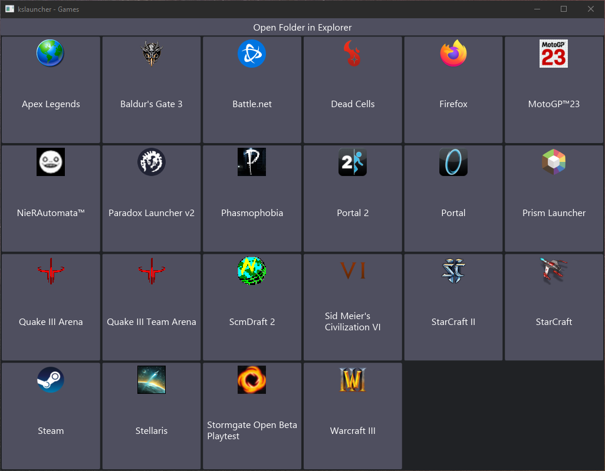

# kslauncher

This is a simple application launcher for Windows. It's designed to be lightweight,
launch fast, launch your program fast, and then get out of the way.

# Getting Started

You can place the exe file anywhere on your computer. After doing this create a shortcut to the exe.
Now go into the properties of the shortcut, and at the end of the "Target" line, add a space, and then
a name for your launcher folder. All shortcuts with the same launcher folder name will show the same
apps. Then you can drag and drop shortcuts or files onto the launcher to move them into the launcher.

This is extremely similar to creating a folder and putting items inside of that folder. The primary
advantage to using kslauncher instead is that it will automatically close once you've made your choice.
Additionally you may prefer the aesthetic of kslauncher. It's not going to be for everyone, I made this
just to customize my own PC experience.

# Screenshot looking at my Games folder

All executable icons belong to their respective owners, do not reproduce or redistribute these icons.